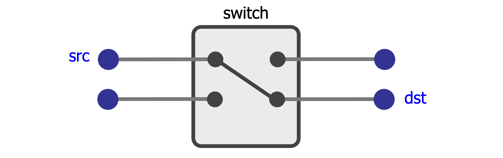
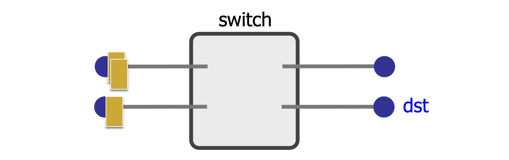

# 计算机网络 - Review01 绪论

**201220014 崔家才**

[TOC]

​     

## Internet基本概念

### 什么是因特网

因特网是一个由互联的主机、个人和无线计算机网络构成的全球系统，它使用因特网协议栈（TCP/IP）将全世界范围内数亿十万计的设备连接起来。因特网是一个网络的网络。

#### 组成

- 主机（也称为端系统）
- 通信链路
- 路由器

#### 服务

- 通信基础设施
- 提供给应用程序的通信服务
    - 可靠的数据交付
    - 尽力的数据交付
    - 有保障的时延和吞吐量

#### 协议

- 网络协议
- 因特网标准

> 协议定义了网络实体之间报文发送与接收的格式和顺序，以及在报文收发的时候采取的行动。

### 如何连接到网络

#### 网络边缘

网络边缘由各种运行应用程序的端系统组成，主要有两种模型：

- 客户端-服务器模型
- 点对点（P2P）模型

#### 接入网

- 家庭接入
    - 数字用户线（DSL）
    - 混合光纤同轴（HFC）
- 企业接入
    - 局域网（LAN）
    - 以太网
- 无线接入
    - 无线局域网（WiFi）
    - 无线广域网（蜂窝网）

#### 网络核心

网络核心是指路由器和交换机构成的网络。

- 电路交换
- 分组交换

> 网络边缘：笔记本电脑、手机、智能家具、服务器
>
> 接入网络：双绞线、无线路由器、同轴电缆、光纤
>
> 网络核心：路由器、交换机

### 怎样传输数据

#### 电路交换

优点：

- 可预计的性能
- 简单快速的数据交换

缺点：

- 电路建立与销毁的复杂性
- 专用资源，通信繁忙的时候资源利用效率低
- 电路建立增加了时延
- 如果交换机坏了，整个电路就坏了

#### 分组交换

 

> 储存转发传输。

优点：

- 高效利用网络资源
- 更容易实现
- 鲁棒性更高

缺点：

- 无法预测的性能
- 需要缓冲区管理和拥塞控制

> 统计多路复用，按需共享。

#### 虚电路

电路交换 + 分组交换。

> 有点像路由路径固定的分组交换。

## 协议体系结构

### 多层协议体系结构的必要性

处理复杂的系统采用分层结构，能够帮助我们分别讨论这个庞大而又复杂的系统中各个定义良好的部分。分层之后，各个模块的维护、更新会变得更加容易。

### OSI与TCP/IP模型

- 每一个层次都承担了最终需要的通信功能的一个子集；
- 每一个层次都依赖下一个更低的层次为它提供一些更基础的功能；
- 每一个层次都向更高的层次提供一些服务；
- 当我们改变某一个层次的实现的时候，不应当要求其他层次中的改变。

| 层次名称   | 层次功能                                                   | 具体实现方式                       | 与其他层次的关系                   |
| ---------- | ---------------------------------------------------------- | ---------------------------------- | ---------------------------------- |
| 物理层     | 提供比特传输                                               | 实际的物理传输媒介（光、电、波等） | 提供比特传输                       |
| 数据链路层 | 封装成帧、媒介访问控制、比特错误检测、帧重传、端对端流控制 | 链路层协议（交换机）               | 提供直接链路上的稳定无错的帧传输   |
| 网络层     | 网络路由、拥塞控制                                         | 网络层协议（路由器）               | 提供多链路多网络主机之间的努力传输 |
| 传输层     | 连接的建立维护与解除、可靠传输                             | 传输层协议                         | 提供主机端口之间的稳定传输         |
| 应用层     | 支持网络应用                                               | 应用层协议                         | 提供应用                           |

> TCP/IP中的应用层在OSI中被细化成了会话层、表示层与应用层。

## 网络性能分析

### 时延

#### 传输时延

将一个分组的所有比特推入链路所需的时间，大小等于分组大小比上链路的传输率。
$$
Transmission\ delay = \frac{Packet\ size}{Transmission\ rate\ of\ the\ link}
$$

#### 传播时延

将一个比特从链路的一端移动到另一端所需的时间，大小等于链路长度比上链路的传播速率。
$$
Propagation\ delay = \frac{Link\ length}{Propagation\ speed\ of\ link}
$$

#### 排队时延

一个分组被处理之前在缓冲区中等待的时间。

> 一般通过统计方式衡量，比如说平均排队时延。

#### 处理时延

交换机处理分组的时间。

节点总时延：
$$
d_{nodal} = d_{proc} + d_{queue} + d_{trans} + d_{prop}
$$

### 丢包

发往目的地的分组在传输过程中被丢弃的比率。

> 可能是因为某个结点的缓冲区满了，所以分组被丢弃了，也可能是因为某些意外情况，或许是被有意丢弃。

### 吞吐量

目标结点从源结点接收数据的比率，单位一般为$bits/sec$。平均吞吐量等于文件总大小比上传输时间。如果是多段传输，则取最小的那一段的平均吞吐量。

