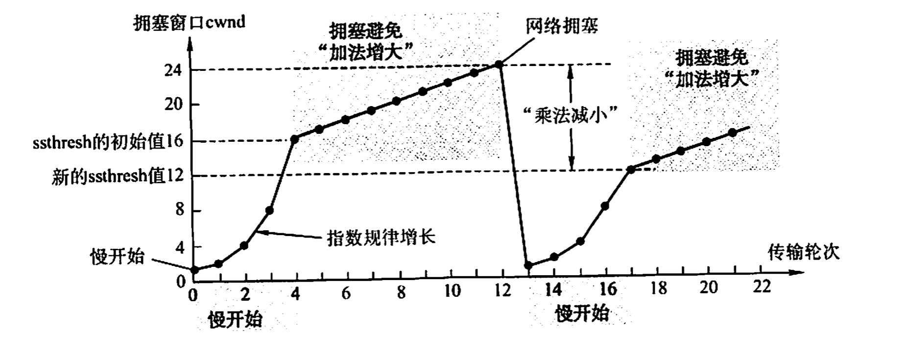

# 计算机网络review-04 传输层

**201220014 崔家才**

[TOC]

## 传输层服务

编址、复用、流控制、面向连接、可靠传输。

## 可靠传输协议的设计

- 数据包损坏
    - 校验和，ACK，NAK信号
- 数据包丢失
    - 超时计时器
- 按序交付、副本检测
    - 以序列号区分，要求序列号空间足够大
- 传输效率
    - 流水线协议
        - Which packets can sender send?
            - Sliding window
        - How does receiver ack packets?
            - Cumulative（累计确认）
            - Selective（选择确认）
        - Which packets does sender resend?
            - Go-Back N (GBN) 回退N帧
            - Selective Repeat (SR) 选择重传

## UDP协议

端口号16位，从0到65535，长度指的是整个UDP数据报的长度，包括8B的首部和数据，单位为字节。校验和计算：

如果源主机不想计算校验和，直接令校验和为0即可。如果计算了校验和，传输过程中出了错，接收端会直接丢弃数据报。

当传输层从IP层收到UDP数据报的时候，将其交付给对应的端口，如果对应的端口没有进程，则返回ICMP端口不可达差错报文。

## TCP

### 基本服务

- 面向连接；
- 端到端（进程之间）；
- 提供可靠交付（无差错、不丢失、不重复且有序）；
- 提供全双工通信；
- 面向字节流。

### 协议首部格式

序号字段指的是本报文所发送的数据的第一个字节的序号。

确认号字段指的是期望收到的对方的下一个报文短的首字节序号。如果确认号为N，则N-1及之前的字节已经接受完毕。

数据偏移占4位，标识首部的长度，单位是4B。由于4位最多表示15，则TCP头最大为60B。因为TCP头最少为20B，则数据偏移最少为5。

URG：紧急位，如果URG=1，表示有紧急数据要发送，紧急数据的大小为紧急指针。

ACK、SYN、FIN用于传输控制，PUSH表示尽快交付给进程，不用在缓冲区排队，RST表示严重差错，必须释放连接重新建立。

窗口：接收方允许发送方的窗口大小。

校验和：同UDP。

选项用于扩展，填充用于保证头部长度为4B的整数倍。

### 连接维护

#### 连接建立：三次握手

> 服务器端的资源在第二次握手时分配，客户端的资源在第三次握手时分配。

如果采用两次握手会出现已失效的连接请求报文段突然又传送到服务器而产生错误。

#### 连接终止：四次挥手

两次挥手后，从客户端到服务器的连接就释放了，但是从服务器到客户端的还没有。

四次挥手后，服务器到客户端的连接才释放，此时服务器的TCP连接完全释放。

客户端的TCP连接等待2MSL（Maximum Segment Lifetime）才完全释放。

- 保证A发送的最后一个确认报文段能够到达B；
- 防止出现已失效的连接请求报文段。

### 拥塞控制算法

发送窗口的上限值$=\min\{rwnd, cwnd\}$。

#### 慢开始与拥塞避免

cwnd=ssthresh的时候既可以用慢开始，也可以用拥塞避免，不过通常选择拥塞避免。

窗口大小的单位时MSS(Maximum Segment Size)。

#### 快重传与快恢复

在收到3个冗余ACK的时候采用。

在流量控制中，发送窗口的大小由接收方来决定；在拥塞控制中，发送窗口由发送方检测网络状态来确定。

最终，发送窗口的上限值$=\min\{rwnd, cwnd\}$。

## 一些计算

$$
最大吞吐率 = \frac{窗口大小(一个RTT传输的有效数据)}{RTT}\\
\\
线路效率 = \frac{最大吞吐率}{带宽}\\
\\
新RTT = (1 - \alpha)旧RTT + 新RTT样本\\
\\
信道利用率U = \frac{L(数据长度)/R(发送速度)}{L/R+ RTT}
$$

> 平均吞吐量=0.75倍的最大吞吐率。

