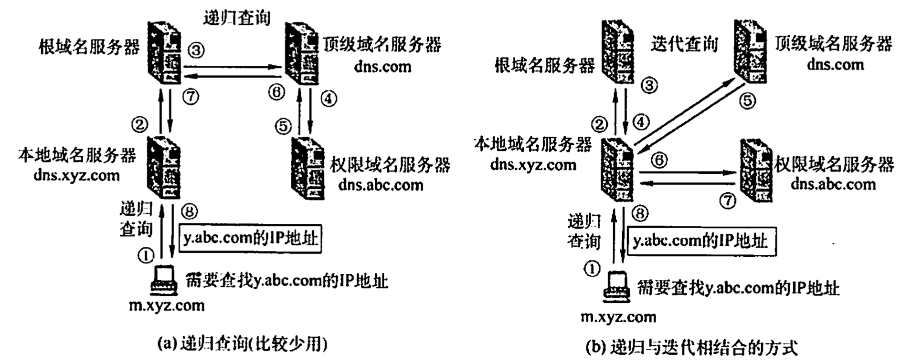
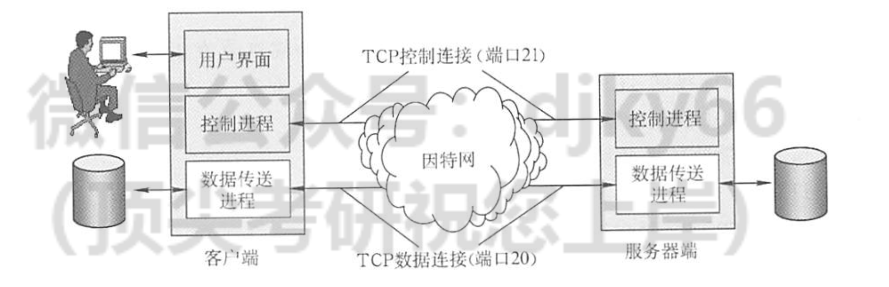
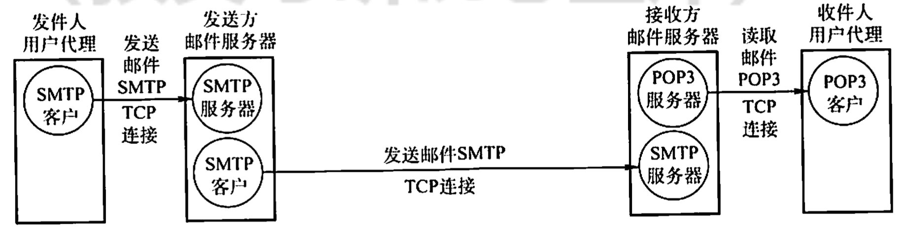
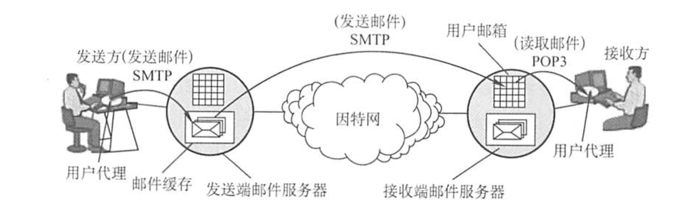
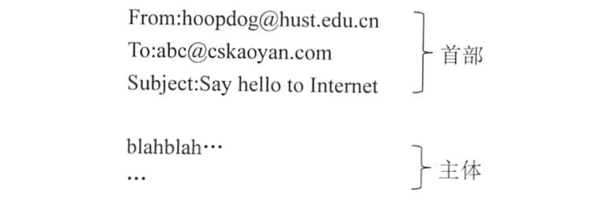
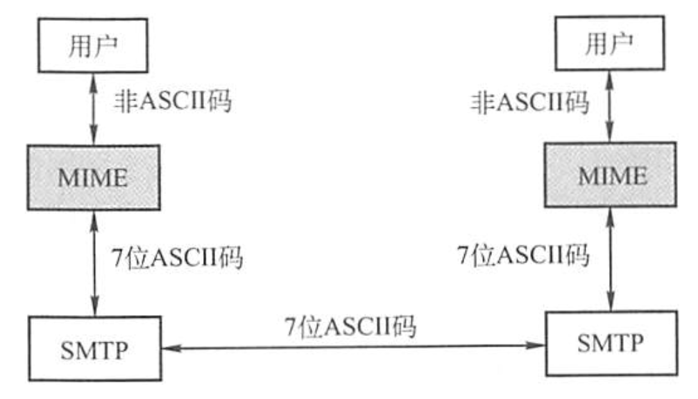
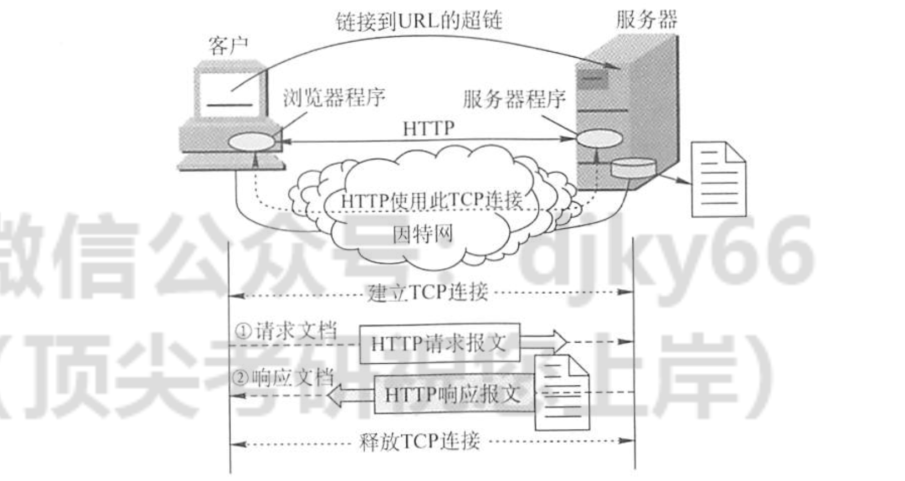
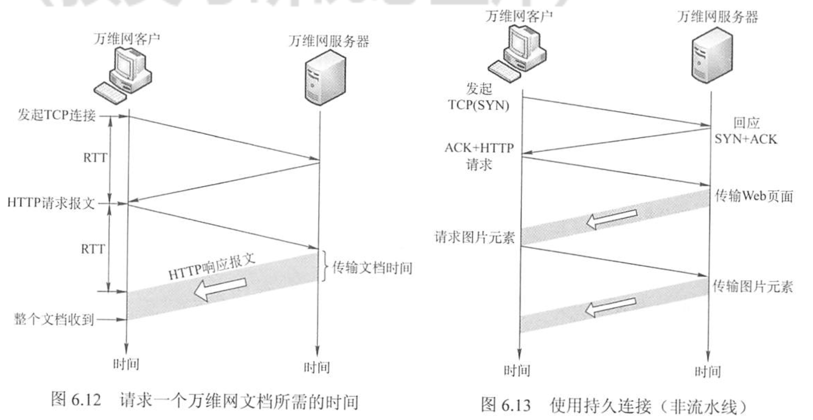
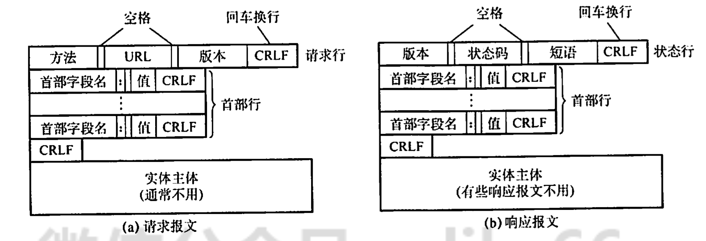

# 计算机网络-Review06 应用层

**201220014 崔家才**

[TOC]

## 网络应用模型

### 客户端/服务器模型

- 服务器处于接收请求的状态；
- 客户端发出服务请求，并等待接收结果；
- 服务器收到请求后，分析请求，进行必要的处理，得到结果并发送给客户端。

### P2P模型

P2P模型的思想是整个网络中的传输内容不再被保存在中心服务器上，每个结点同时具有上传、下载功能，其权利和义务都是大体对等的。

## DNS系统

### 层次域名空间

因特网采用层次树状结构的命名方法。

采用这种命名方法，任何一个连接到因特网的主机或路由器，都有一个唯一的层次结构名称，即域名。

域是名空间中一个可被管理的划分。

域可以划分为子域，子域还可以被划分为子域的子域。于是便有了二级域名，三级域名，一般从右往左排列，用.分开。

熟知端口为53，UDP。

### 域名服务器

因特网的域名系统被设计为一个分布式的数据库系统，并采用客户/服务器模型。域名到IP的映射是由服务器完成的。

- 根域名服务器
- 顶级域名服务器
- 授权域名服务器
- 本地域名服务器

### 域名解析过程

## FTP

### FTP协议的工作原理

1. 打开熟知端口21（控制端口），使客户进程能够连接上；
2. 等待客户进程发连接请求；
3. 启动从属进程来处理客户进程发来的请求。主进程与客户进程并发执行，从属进程对客户进程的请求处理完毕后即终止；
4. 回到等待状态，继续接受其他客户进程的请求。

### 控制连接与数据连接

数据连接分为主动连接和被动连接：

- 主动连接（PORT命令）：服务器通过20端口和客户端开放的端口连接；
- 被动链接（PASV命令）：客户端连接到服务器本地开放的某个端口。

## 电子邮件

### 电子邮件系统的组成结构

#### 电子邮件系统最主要的组成构件

#### 电子邮件的发送、接受过程

SMTP = Simple Mail Transfer Protocol（熟知端口为25，TCP）

POP3 = Post Office Protocol - Version 3（熟知端口为110，TCP）

IMAP = Internet Message Access Protocol

### 电子邮件格式与MIME

邮件系统自动将首部的必要信息提取出来放在信封上。From是系统自动生成的，To需要用户填写，Subject是可选的。邮件地址 = 用户名@邮箱（邮件服务器）地址。

MIME = Multiple Internet Mail Extensions，多用途网际邮件扩充，其作用是增加了邮件的编码方式，使得一些非ASCII的数据可以用SMTP传输。

## WWW

### WWW的概念与组成结构

万维网是一个分布式、联机式的信息储存空间，在这个空间中：一样有用的事物称为一样资源，并由一个全域“统一资源定位符”（URL）标识。

万维网的内核由三个标准组成：URL、HTTP、HTML。

URL的一般结构为：`<协议>://主机:端口/路径`。

- 协议：用什么协议来访问万维网文档，常见的协议有HTTP，FTP等；
- 主机：存放资源的主机的域名或者IP；
- 端口和路径有时候可以省略；
- URL不区分大小写。

万维网的工作流程如下：

1. Web用户使用浏览器（指定URL）与Web服务器建立连接，并发送浏览请求；
2. Web服务器把URL转换为文件路径，并返回信息给Web浏览器；
3. 通信完成，关闭连接。

### HTTP协议

HTTP熟知端口为80，基于TCP。TCP是面向连接的，但是HTTP本身是无连接的（即通信双方事先不需要建立HTTP连接）。HTTP是无状态的，同一个客户第一次与第二次访问对于服务器来说都只是一次访问而已。实际过程中会使用Cookie来记录用户状态，不过Cookie是储存在用户本地的浏览器缓存里面的。

HTTP既可以使用非持久连接，也可以使用持久连接（HTTP/1.1之后支持）。

HTTP1.1的默认模式是流水线持久连接，从而平均下来一次收发的时间不至于是RTT。

HTTP是面向为本的，其报文格式如下：

几个常用的方法：

| 方法    | 意义                          |
| ------- | ----------------------------- |
| GET     | 请求读取由URL标识的信息       |
| HEAD    | 请求读取由URL标识的信息的首部 |
| POST    | 给服务器添加信息（如注释）    |
| CONNECT | 用于代理服务器                |

### Web缓存

Web缓存器也叫代理服务器，假设浏览器正在请求某个URL对象：

1. 浏览器创建一个到Web缓存器的TCP连接，并向Web缓存器中的对象发送一个HTTP请求；
2. Web缓存器进行检查，看看本地是否储存了该对象的副本。如果有，Web缓存器就向客户浏览器用HTTP响应报文返回该对象；
3. 如果Web缓存器中没有这个对象，它就打开一个与该对象的初始服务器的TCP连接，Web缓存器则在这个缓存器到服务器的TCP连接上发送一个HTTP请求，在收到该请求后，初始服务器向该Web缓存器发送具有该对象的HTTP响应；
4. 当Web缓存器接收到该对象时，它在本地存储空间存储一份副本，并向客户的浏览器用HTTP响应报文发送该副本（通过现有的客户浏览器和Web服务器之间的TCP连接）。

### CDN

CDN = Content Delivery Network

本质上是缓存与选择，选择位置比较近的服务器，缓存刚刚被访问的内容。想当于一个更广义的Web缓存。

